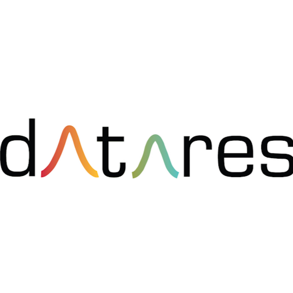

<h2 align="center">👋 Hello! Welcome to DataRes</h2>

    </img>

<h4 align="center">At DataRes, we solve problems and craft stories with data.</h4>

We provide a platform for aspiring data scientists and analysts to collaborate on impactful data projects. If you love playing with data, creating powerful visualizations, or building predictive models, you have a home at DataRes.

<h4>What teams does DataRes have?</h4>
<ul>
    <li>Data Blog Team - This team works on simpler analytics based projects and publishes a variety of data centric journal articles</li>
    <li>Research Team - This team tackles advanced machine learning problems in the areas of computer vision, natural language processing, and reinforcement learning.</li>
    <li>Consulting Team - This team offers pro bono consulting services to startups and companies in the Los Angeles area (currently not accepting applications)</li>
</ul>

<h4>How can I stay up to date with events/projects happening at DataRes?</h4>
Follow us on our social media!

<ul>
<li>Facebook: <a href="https://www.facebook.com/ucladatares">https://www.facebook.com/ucladatares</a></li>
<li>Instagram: <a href="https://www.instagram.com/ucladatares/">https://www.instagram.com/ucladatares</a></li>
<li>Website: <a href="https://ucladatares.com">https://ucladatares.com</a></li>
<li>Medium: <a href="https://ucladatares.medium.com/">https://ucladatares.medium.com</a></li>
<li>LinkedIn: <a href="https://www.linkedin.com/company/ucla-datares/">https://www.linkedin.com/company/ucla-datares</a></li>
</ul>
